# Rethink Sans

Rethink Sans was designed in 2023 for Rethink by Hans Thiessen in collaboration with the fine folks at Google Fonts. A humble open source font built on the shoulders of DM Sans and Poppins, Rethink Sans was thoughtfully turbocharged to help everyone design in Google Workspace with greater confidence and craft.

Deceptively simple, Rethink Sans' features include : size specific tracking, tabular lining figures, and OpenType for everyone.

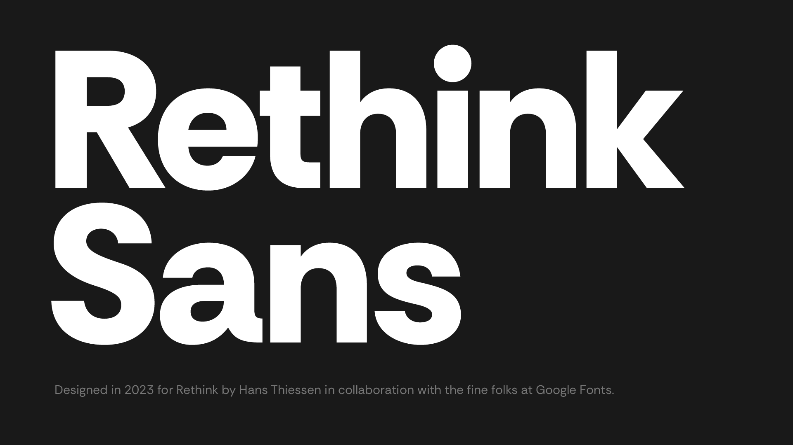
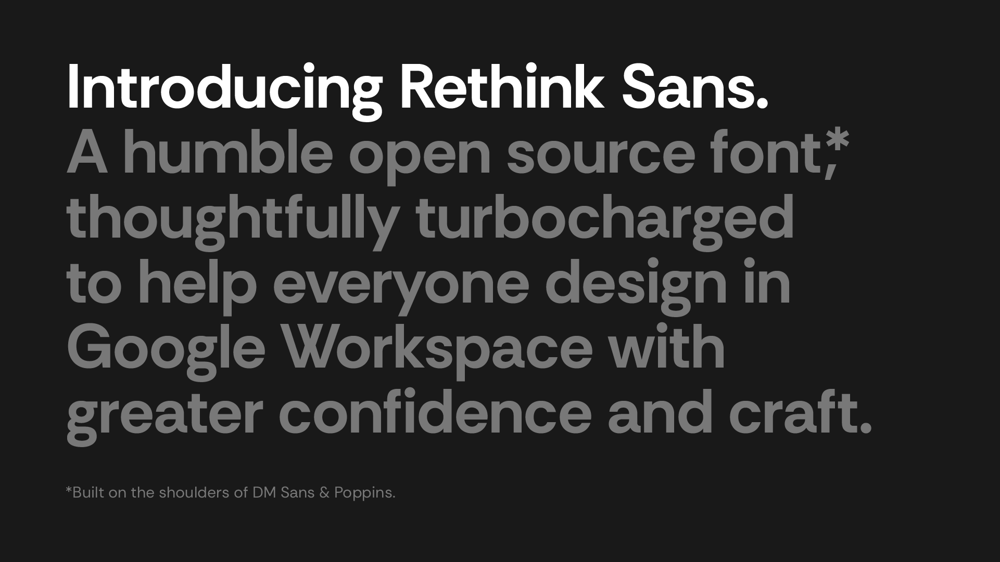
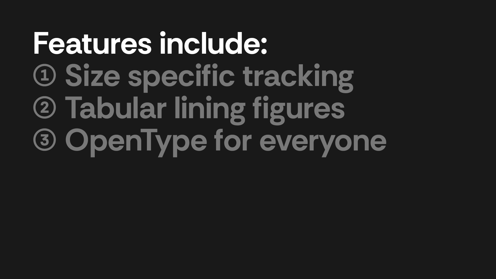
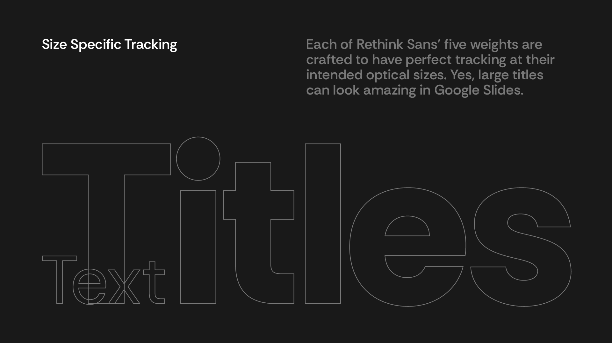
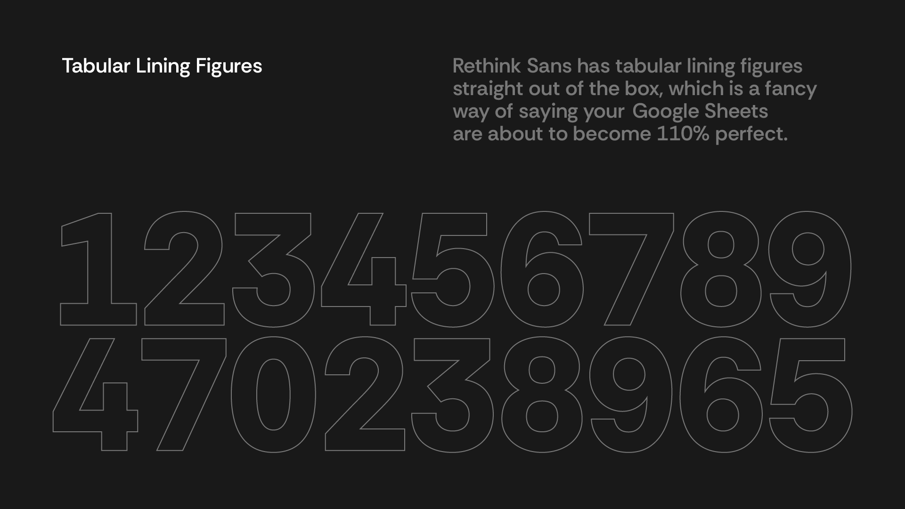
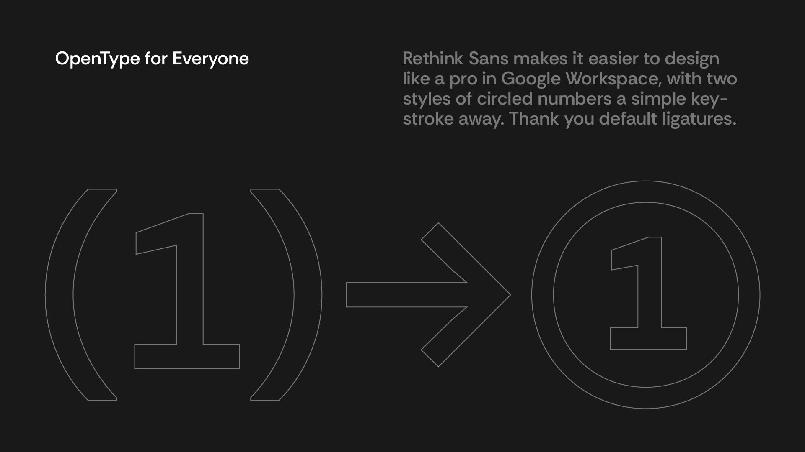
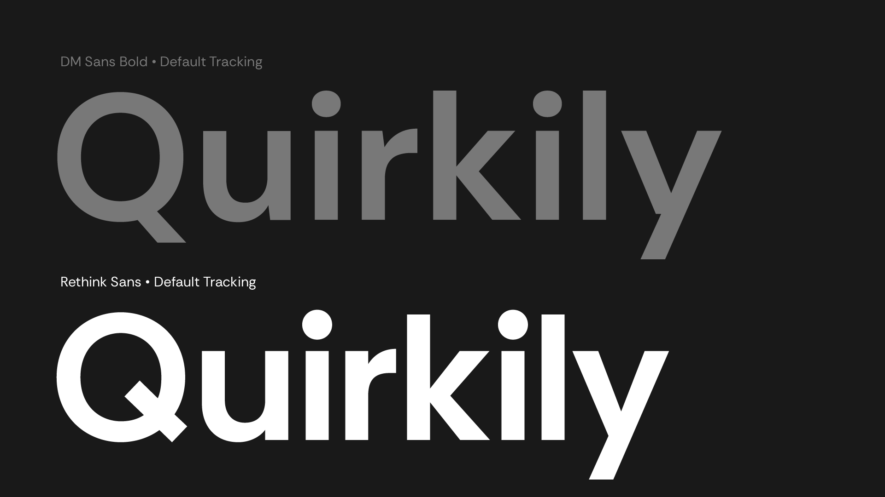
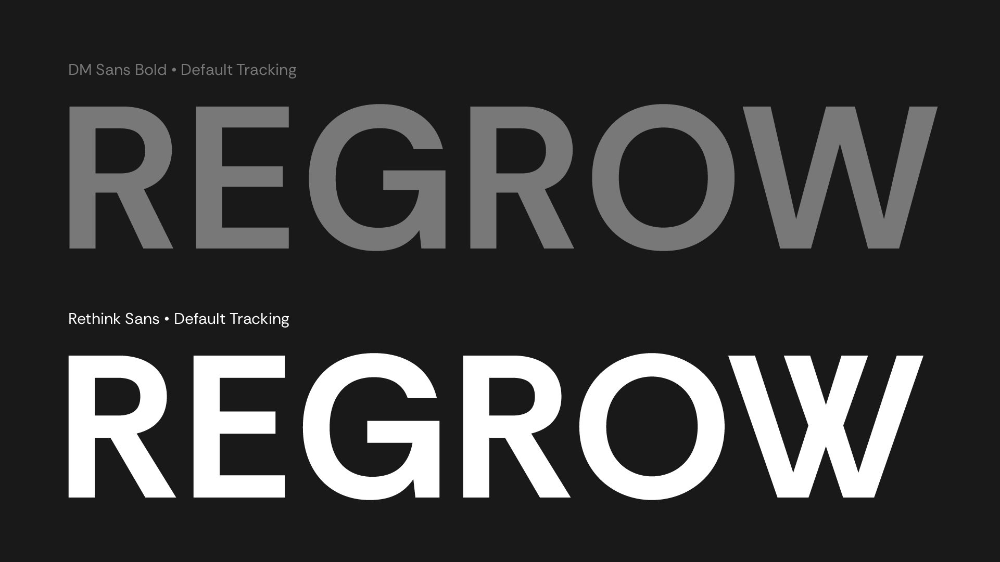
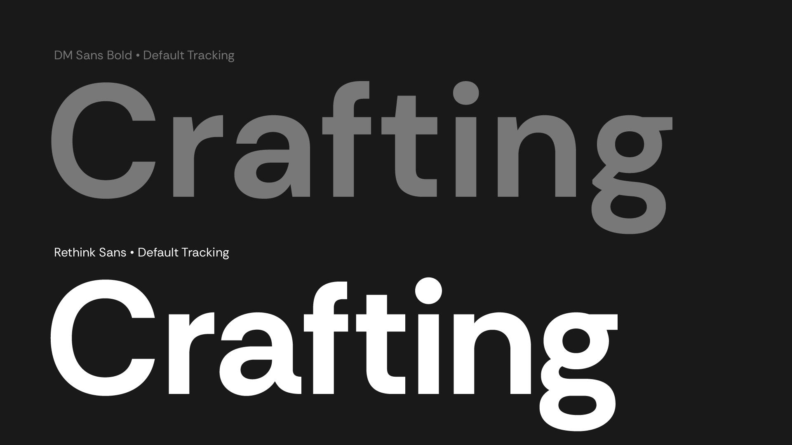
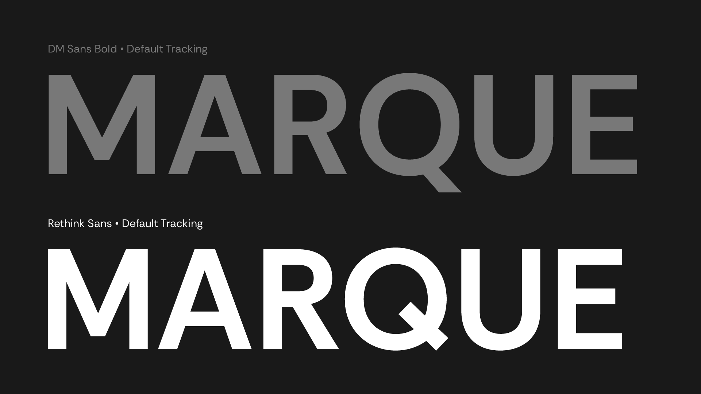
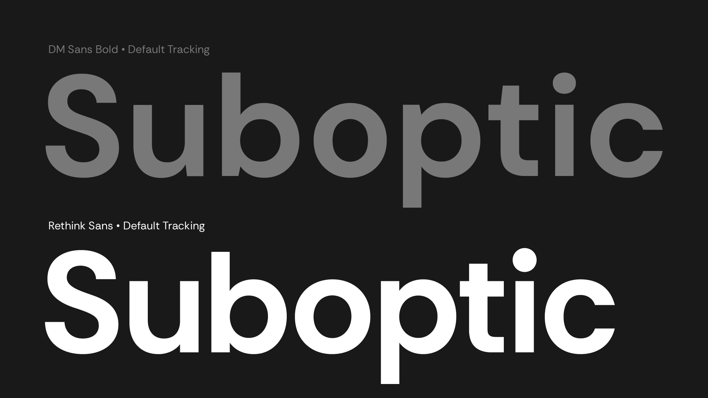
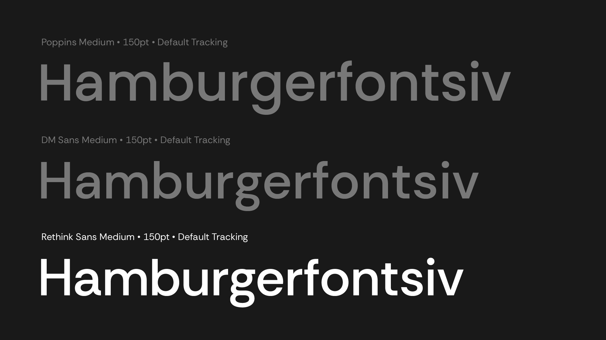
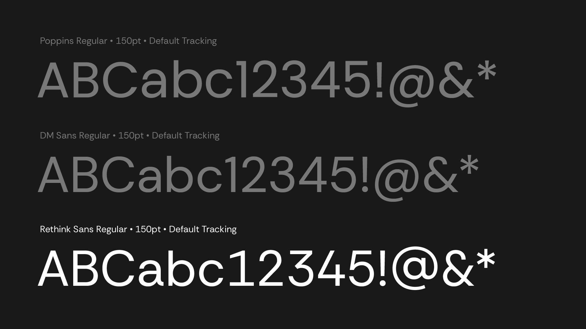

## About Rethink

Rethink is one of the largest global independent creative agencies. Founded in Vancouver in 1999, it now has offices in New York, Toronto, Vancouver, and Montréal.

To learn more about Rethink, visit [rethinkideas.com](https://rethinkideas.com)

## Authors

* Original Poppins design by Jonny Pinhorn
* Modifications for DM Sans by Colophon Foundry
* Modifications for Rethink Sans by Hans Thiessen 

## Building

Fonts are built automatically by GitHub Actions - take a look in the "Actions" tab for the latest build.

If you want to build fonts manually on your own computer:

* `make build` will produce font files.
* `make test` will run [FontBakery](https://github.com/googlefonts/fontbakery)'s quality assurance tests.
* `make proof` will generate HTML proof files.

The proof files and QA tests are also available automatically via GitHub Actions - look at https://hans-thiessen.github.io/Rethink-Sans-2.

## License

This Font Software is licensed under the SIL Open Font License, Version 1.1. This license is available with a FAQ at https://scripts.sil.org/OFL

## Repository Layout

This font repository structure is inspired by [Unified Font Repository v0.3](https://github.com/unified-font-repository/Unified-Font-Repository), modified for the Google Fonts workflow.
